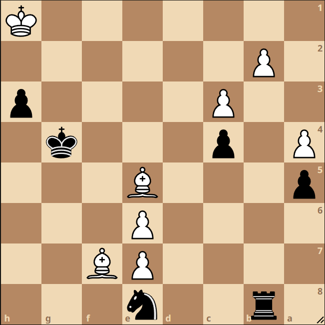

During a game I was running between Blunder and Zahak, I noticed Blunder played a very odd move that lost the game instantly. In the position:



Blunder chose the move Rxb2, which of course loses on the spot. After a couple of spite checks, Zahak just moved its bishop, cashed in its
passed pawn for a queen, and checkmated Blunder in short order.

I immediately started investigating why Blunder chose to make such a poor move, and eventually discovered a rather embaressing oversight in my move making
code:

```
switch moveType {
...
case Attack:
    if flag == AttackEP {
        // If it's an attack en passant, get the actually capture square
        // of the pawn being captured, remove it, and put the moving pawn
        // on the destination square...
        capSq := uint8(int8(to) - getPawnPushDelta(pos.SideToMove))
        state.Captured = pos.Squares[capSq]

        pos.zobristClearPiece(capSq)
        pos.zobristPutPiece(Pawn, pos.SideToMove, to)
    } else {
        // Otherwise if the move is a normal attack, remove the captured piece
        // from the position, and put the moving piece at its destination square...
        pos.zobristClearPiece(to)
        pos.zobristPutPiece(state.Moved.Type, pos.SideToMove, to)
    }
...
}
```

If you look closely, you'll realize that after I make an attack move on the board, I'm forgetting a very important last step: Resetting the 
fifty move rule counter, which is used to track when a position is drawn. If the fifty move rule counter reaches 50 moves without a pawn
push or capture, the game can be declared a draw.

Since I forgot to reset the counter in the above code, Blunder took on b2 in the above position, and since the fifty move rule counter was
near fifty, it thought after giving a couple of checkes the game would be drawn. Of course the capture itself reset the counter, and
so Blunder lost.

I think I probably introduced this bug when I was optimizing Blunder's move generation code for the 8.0.0 release. Interestingly, I was suprised
that fixing the bug wasn't worth too much. Regardless, at least now Blunder shouldn't lose drawn positions in such spectacular fashions.
